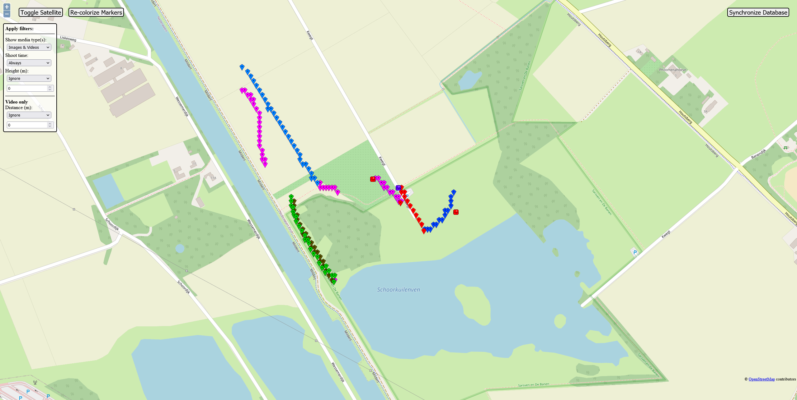

# DroneMap
A web-based application to explore your DJI drone footage on a map. Point the server at the directory that contains your footage, press 'Synchronize Database' and the server will handle the rest.

## Screenshots

Plain map view of data points

Satellite view of data points

Inspecting a single data point

Watching a video after clicking the thumbnail

Inspecting an image

Example use (a bit outdated but the gist is the same)

## Current features

- Directory scanning
- Automatic analysis and parsing of scanned files
- Plotting of footage data points / images onto OSM or Satellite view
- Filtering plotted footage based on attributes
- Inspecting data point / image information including camera settings
- Opening and watching source footage at exact point of the data point in the footage

## Potential future features (high to low priority)

- Improved layout on data point / image inspection pages
- Improve marker visibility through coloring and positioning (mainly in high density areas)
- Transcoded streaming, raw footage streaming is less than ideal for non-network streaming
- Authentication for exposing service to internet
- File / footage management page

## Running (docker)

1. Copy and adapt `docker-compose.yml`
2. Run `docker-compose up -d`
3. If the `dronemap` container's logs mention `ECONNREFUSED`, 
please execute `node ace migration:run --force` manually in the container after the database container has fully started.

## Running (development)

1. `apt update && apt install ffmpeg`
2. `git clone git@github.com:vimodev/dronemap.git`
3. Set up database
4. Fill out .env and generate key with `node ace generate:key`
5. `npm run dev`
